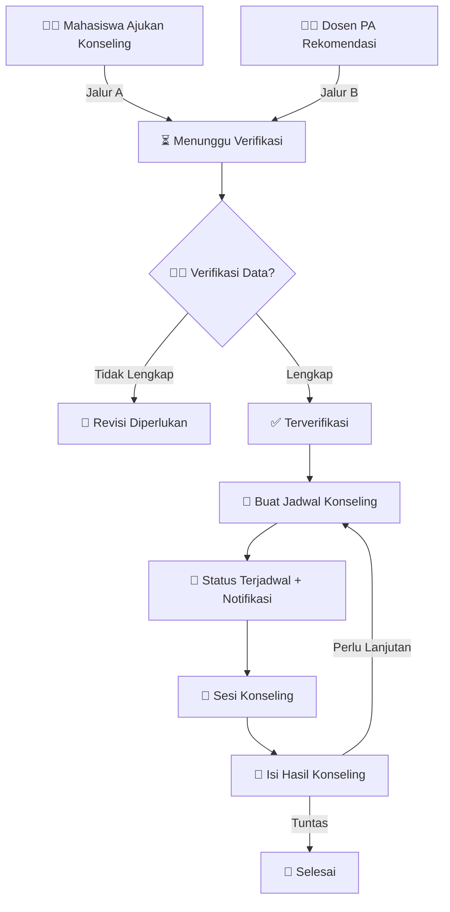

# 🎓 SIBILING UBBG - Sistem Informasi Bimbingan Konseling

> 🌐 **SIBILING** adalah aplikasi web yang dirancang untuk mendigitalisasi dan mengelola alur layanan bimbingan konseling di **Universitas Bina Bangsa Getsempena (UBBG)**.  
> Dibuat untuk mahasiswa, dosen konselor, dosen pembimbing, dan admin agar alur konseling jadi lebih **efisien, transparan, dan modern**.


---

## 🚀 Tech Stack (Teknologi yang Digunakan)


---

## 🧩 Algoritma & Alur Kerja Utama
Sistem ini dirancang dengan 4 peran (aktor) utama, masing-masing dengan alur kerjanya sendiri.

### 1. Aktor Sistem
- 🧑‍🎓 **Mahasiswa** → Pengguna utama yang membutuhkan layanan konseling.
- 👩‍⚕️ **Dosen Konseling** → Konselor profesional yang memverifikasi, menjadwalkan, dan melaksanakan sesi konseling.
- 👨‍🏫 **Dosen Pembimbing** → Dosen PA yang dapat memantau status konseling mahasiswa bimbingannya dan merekomendasikan mereka.
- 🛠️ **Admin** → Super user yang mengelola data master, memantau seluruh aktivitas, dan memiliki hak akses penuh.

### 2. Alur Pengajuan Konseling



---

## 🗄️ Struktur Database
Database proyek ini dibangun dan diisi menggunakan dua perintah utama di terminal. Proses ini memastikan bahwa struktur tabel sesuai dengan aturan dari sistem informasi kampus dan semua data warisan (legacy) berhasil diimpor.

### Perintah Setup Database
**Membangun Struktur Tabel (Migrations):**
```bash
php artisan migrate:fresh
```

**Mengisi Data dari Kampus (Import SQL):**
```bash
mysql -u root sibiling_bbg < database/sql/data_final.sql
```

Tabel utama meliputi:  
- `mahasiswa` 🧑‍🎓  
- `dosen` 👨‍🏫  
- `roles` 🛠️  
- `konseling` 📑  
- `jadwal_konseling` 📅  
- `hasil_konseling` 📝  
- `prodi` 🎓  

---

## 📑 Struktur Menu & Fitur (Rencana Final)

| Role | Menu | Fitur |
|------|------|-------|
| 🛠️ **Admin** | Dashboard | Statistik global |
| | Manajemen Dosen | Detail lengkap (60+ kolom) ✅ |
| | Manajemen Mahasiswa | Per angkatan, detail prodi ✅ |
| | Manajemen Konseling | Monitoring kasus 🚧 |
| | Pengguna & Roles | Role-based access |
| | Laporan | Cetak statistik |
| 👩‍⚕️ **Dosen Konseling** | Dashboard | Jadwal + pengajuan baru |
| | Daftar Pengajuan | Verifikasi / revisi |
| | Jadwal Saya | Kelola jadwal |
| | Kasus Aktif | Isi hasil konseling |
| 👨‍🏫 **Dosen Pembimbing** | Dashboard | Ringkasan |
| | Mahasiswa Bimbingan | Status konseling |
| | Rekomendasikan Konseling | Form rekomendasi |
| 🧑‍🎓 **Mahasiswa** | Dashboard | Status konseling |
| | Ajukan Konseling | Form pengajuan |
| | Riwayat Konseling | Status, jadwal, hasil |

---

✨ Dibangun dengan ❤️ oleh **Tim SIBILING - UBBG**
